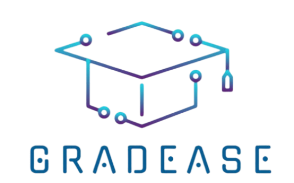

# GradEase

<div align="center">
  
  <p><strong>A comprehensive graduation project management platform for students and supervisors</strong></p>
</div>

## 📝 About

GradEase is a Flutter-based mobile application designed to streamline the graduation project process for both students and supervisors. The platform provides comprehensive tools for project management, collaboration, AI-powered assistance, and progress tracking throughout the academic journey.

## ✨ Key Features

### 👨‍🎓 For Students
- **Project Management**: Create and manage graduation projects with team collaboration
- **Team Formation**: Find and connect with other students to form project teams
- **AI Assistant**: Get AI-powered help with project evaluation and plagiarism checking
- **Progress Tracking**: Monitor project milestones and completion status
- **Note Taking**: Create and organize project-related notes and documentation
- **Communication**: Direct messaging with supervisors and team members
- **Task Management**: Track project tasks and deadlines

### 👨‍🏫 For Supervisors
- **Student Supervision**: Manage multiple student projects and teams
- **Progress Monitoring**: Track student progress and provide feedback
- **Communication Hub**: Direct communication channel with supervised students
- **Project Evaluation**: Review and evaluate student submissions
- **Dashboard**: Comprehensive overview of all supervised projects

### 🤖 AI-Powered Features
- **Document Evaluation**: AI-powered analysis of project documents using Google Gemini
- **Plagiarism Detection**: Automated plagiarism checking for academic integrity
- **Smart Chat**: AI assistant for project guidance and support
- **Document Processing**: Support for DOCX and PDF file analysis

## 🛠️ Technology Stack

### Frontend
- **Flutter**: Cross-platform mobile development framework
- **Dart**: Programming language
- **Provider**: State management for reactive UI updates
- **Flutter BLoC**: Business Logic Component architecture
- **ScreenUtil**: Responsive design for multiple screen sizes

### Backend & Database
- **Firebase Core**: Backend-as-a-Service platform
- **Cloud Firestore**: NoSQL document database for real-time data
- **Firebase Auth**: User authentication and authorization
- **Firebase Storage**: File storage for documents and media
- **Firebase Messaging**: Push notifications
- **Cloud Functions**: Serverless backend functions

### AI & ML
- **Google Gemini AI**: Advanced AI model for document analysis
- **Gemini 2.0 Flash**: Latest AI model for faster processing

### Additional Libraries
- **Dio**: HTTP client for API communications
- **Retrofit**: Type-safe HTTP client
- **Cached Network Image**: Efficient image loading and caching
- **File Picker**: Document and file selection
- **FL Chart**: Data visualization and progress charts
- **Shimmer**: Loading animations
- **URL Launcher**: External link handling

## 🚀 Getting Started

### Prerequisites
- Flutter SDK (>=2.17.0 <3.0.0)
- Dart SDK
- Android Studio / VS Code
- Firebase account
- Google Cloud account (for Gemini AI)

### Installation

1. **Clone the repository**
   ```bash
   git clone <repository-url>
   cd GradEase-main
   ```

2. **Install dependencies**
   ```bash
   flutter pub get
   ```

3. **Firebase Setup**
   - Create a new Firebase project
   - Add your Android/iOS apps to the project
   - Download and place the configuration files:
     - `google-services.json` in `android/app/`
     - `GoogleService-Info.plist` in `ios/Runner/`

4. **Configure Gemini AI**
   - Obtain a Gemini API key from Google Cloud Console
   - Update the API key in the AI service files

5. **Run the application**
   ```bash
   flutter run
   ```

### Build for Production

**Android:**
```bash
flutter build apk --release
```

**iOS:**
```bash
flutter build ios --release
```

## 📱 App Architecture

```
lib/
├── main.dart                 # App entry point
├── firebase_options.dart     # Firebase configuration
├── Features/
│   ├── student/             # Student-specific features
│   │   ├── home_screen.dart
│   │   ├── ai_chat.dart
│   │   ├── group_chat_screen.dart
│   │   ├── progress_screen.dart
│   │   └── ...
│   └── SPV/                 # Supervisor features
│       ├── screens/
│       └── widgets/
├── AI/                      # AI integration modules
│   ├── check_eval.dart      # Document evaluation
│   └── check_palagrism.dart # Plagiarism detection
└── Core/                    # Core utilities
    ├── DI/                  # Dependency injection
    ├── Helpers/             # Helper functions
    └── NetWorking/          # Network layer
```

## 🎯 User Roles

### Student Role
- Create and join project groups
- Communicate with team members and supervisors
- Upload and manage project documents
- Track project progress
- Access AI-powered assistance

### Supervisor Role
- Oversee multiple student projects
- Provide feedback and guidance
- Monitor student progress
- Evaluate project submissions
- Communicate with students

## 🔧 Configuration

### Firebase Configuration
The app uses Firebase for backend services. Ensure proper configuration of:
- Authentication providers
- Firestore security rules
- Storage bucket permissions
- Cloud Functions deployment

### AI Services
Configure the Gemini AI API key in:
- `lib/AI/check_eval.dart`
- `lib/AI/check_palagrism.dart`

## 🤝 Contributing

1. Fork the repository
2. Create a feature branch (`git checkout -b feature/amazing-feature`)
3. Commit your changes (`git commit -m 'Add some amazing feature'`)
4. Push to the branch (`git push origin feature/amazing-feature`)
5. Open a Pull Request

## 📄 License

This project is licensed under the MIT License - see the [LICENSE](LICENSE) file for details.

## 🎨 Screenshots

<div align="center">
  
  
  
</div>

## 📞 Support

For support and questions, please reach out through:
- GitHub Issues
- Project documentation
- Developer contact information

---

<div align="center">
  <p>Made with ❤️ for academic excellence</p>
</div>
